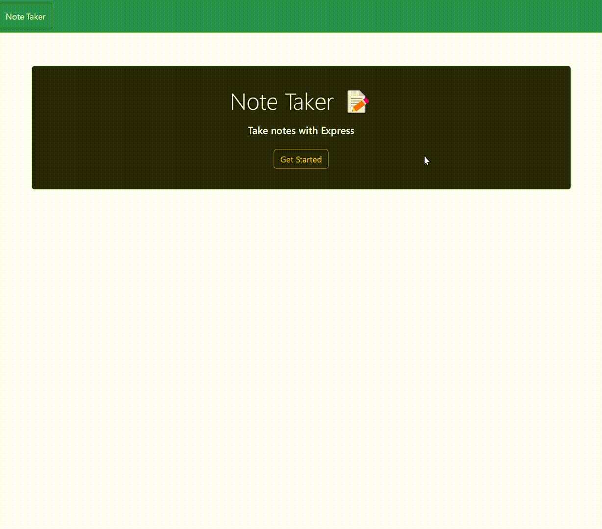
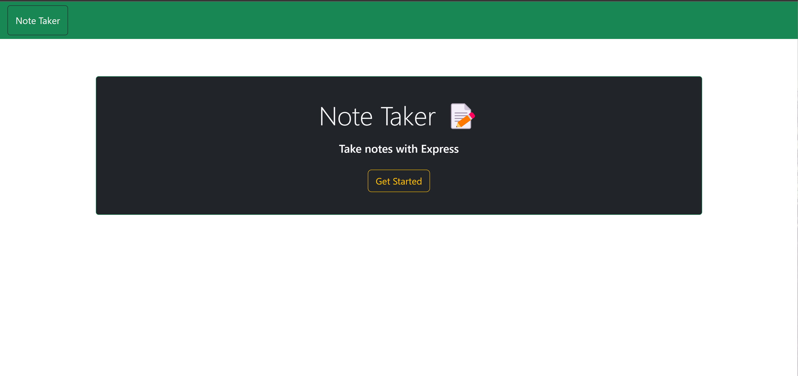
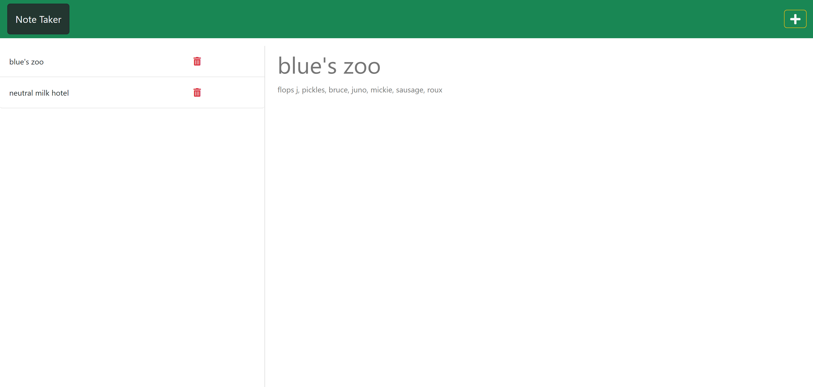
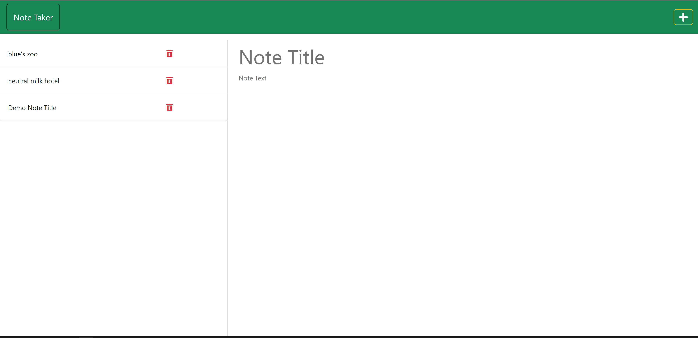
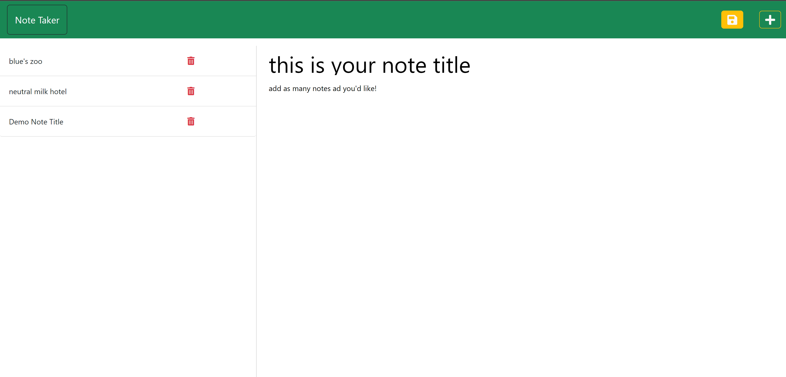

# Note Taker Express

## Description
This is an application that can be used to write and save notes. It will use an Express.js back end and will save and retrieve note data from a JSON file. This application's front end was created already by default starter code. I built the back end and connected the back end to the front end.  
The entire application was then successfully deployed to Heroku.  

I did go back and try to refactor the back end code a bit to clean it up and make it as short and efficient as possible. And while the front end wasn't the focus since it was given, I did dabble in some of its styling; that light blue color isn't pleasing to look at over and over again lol.

Provide a short description explaining the what, why, and how of your project. Use the following questions as a guide:

## Table of Contents
- [Installation](#installation)
- [Usage](#usage)
- [Deployment](#deployment)
- [Technologies](#technologies)
- [Credits](#credits)
- [License](#license)
- [Contact Information](#contact-information)

## Installation
No installation is necessary to use this application.

## Usage (Instructions/How-To Use)
Opening the link brings you to the application's landing page. Click the 'Get Started' button to start creating your notes.  
Enter a new note title in the bigger text box and the note details in the smaller text box. Once you've added text to these two sections, a save icon will appear in the top right corner of the page. Click it to save the note; it will populate in the left-hand column along with the existing saved notes. To create a new note, click the plus sign in the top right corner.  
To view an existing note, click on its title. To delete a note, click the trash can displayed for that note.  
To return to the landing page, click the 'Note Taker' button in the top left corner. 

## Deployment
Live URL deployed to Heroku: <a href="https://incredible-note-taker-express.herokuapp.com/">Note-Taker-Express</a>

<!-- in the parentheses is just the relative path to the screenshot-->

## Technologies
Node.js, Express.js, JavaScript, HTML, CSS, Bootstrap

## Credits
<a href= "https://github.com/coding-boot-camp/miniature-eureka">Starter Code</a>

Youtube videos / express js crash course - Traversy Media <a href="https://www.youtube.com/watch?v=L72fhGm1tfE&list=PLKFBXWhgMu_MHrrELsoH9BLPRBUXM-SXt&index=5">Express JS Crash Course</a>  

Net Ninja YouTube Videos: <a href="https://www.youtube.com/watch?v=zb3Qk8SG5Ms&list=PL4cUxeGkcC9jsz4LDYc6kv3ymONOKxwBU">Node.js Crash Course Tutorial</a>

## License
This project is licensed under the MIT license. For more information about this license and what it entails, visit the MIT website <a href="https://opensource.org/licenses/MIT">here</a>.

## Contact Information
  If you liked this project and want to see more, feel free to check out my other repos [here](https://github.com/blairrrrwho).  
  For any questions or inquiries, you can reach me at blair10324@gmail.com for further information.